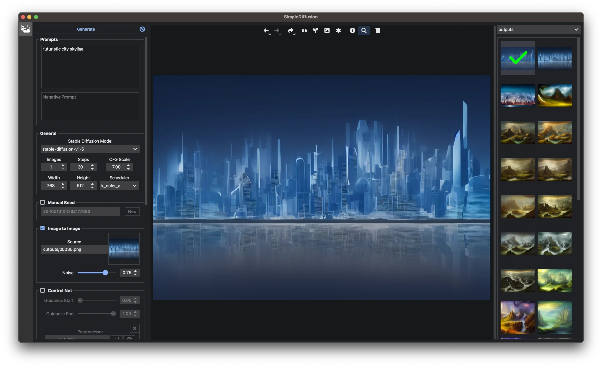

# SimpleDiffusion

A native UI for Stable Diffusion using the `diffusers` library.

### Installation on Windows

1. Install [Python](https://www.python.org/downloads/windows/), checking "Add Python to PATH".
2. Install [git](https://git-scm.com/download/win).
3. Download this repository, for example by running `git clone https://github.com/pdoane/simple-diffusion.git`.
4. Execute `install.bat` from Windows Explorer as normal, non-administrator, user.
   Use this also to update when requirements/dependency versions change
5. Execute `run.bat` from Windows Explorer as normal, non-administrator, user.

### Installation on macOS

1. Install MacOS Developer Tools
2. Download this repository, for example by running `git clone https://github.com/pdoane/simple-diffusion.git`.
3. Navigate to the directory containing this project.
4. Execute `install.sh` (use this also to update when requirements/dependency versions change)
5. Execute `run.sh`

### Features

- Text to Image
- Image to Image
- Prompt Weighting using [Compel](https://github.com/damian0815/compel/blob/main/Reference.md)
- ControlNet (1.0, 1.1, Txt2Img, Img2Img, Multi-model)
- LoRA
- Textual Inversion
- High-resolution fix
- ESRGAN Upscaling
- GFPGAN Face Restoration
- Image generation with real-time preview of latent space
- Thumbnail viewer with collections

### Roadmap

Near-term:
- ControlNet preprocessor arguments
- Openpose variants
- Inpainting
- Collapsing panels in UI

Evaluate:
- Self-Attention Guidance
- MultiDiffusion
- Long Prompt Weighting
- ControlNet Control Mode (previously Guess Mode)
- ControlNet Mediapipe Face
- ControlNet Reference-Only control
- ControlNet T2I-Adapter
- ControlNet High-resolution control image sampling

Requires new versions of dependencies:
- torch
  - Retest float16 support
