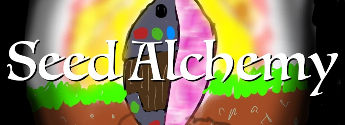

# SeedAlchemy: AI Image Generation

# Features

- Text to Image
- Image to Image
- Prompt Weighting using [Compel](https://github.com/damian0815/compel/blob/main/Reference.md)
- ControlNet (1.0, 1.1, Txt2Img, Img2Img, Multi-model)
- LoRA
- Textual Inversion
- High-resolution fix
- ESRGAN Upscaling
- GFPGAN Face Restoration
- Image generation with real-time preview of latent space
- Thumbnail viewer with collections

# Installation

## Windows

1. Install [Python](https://www.python.org/downloads/windows/), checking "Add Python to PATH".
2. Install [git](https://git-scm.com/download/win).
3. Download this repository, for example by running `git clone https://github.com/pdoane/simple-diffusion.git`.
4. Execute `install.bat` from Windows Explorer as normal, non-administrator, user.
   Use this also to update when requirements/dependency versions change
5. Execute `run.bat` from Windows Explorer as normal, non-administrator, user.

## macOS

1. Install Python and git, one option is via the MacOS Developer Tools
2. Download this repository, for example by running `git clone https://github.com/pdoane/simple-diffusion.git`.
3. Navigate a terminal to the directory containing this project.
4. Execute `install.sh` (use this also to update when requirements/dependency versions change)
5. Execute `run.sh`

# Roadmap

Near-term:
- Outpainting
- Inpainting

Evaluate:
- ControlNet Control Mode (previously Guess Mode)
- ControlNet Reference-Only control
- ControlNet T2I-Adapter
- ControlNet High-resolution control image sampling
- Clip Interrogator
- Long Prompt Weighting
- Self-Attention Guidance
- MultiDiffusion
