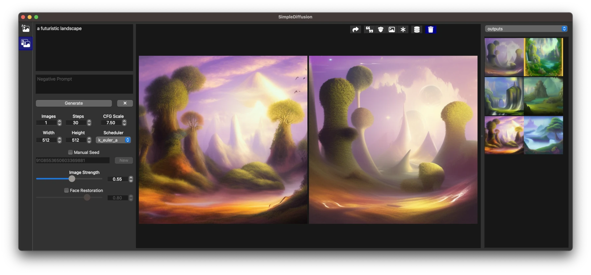

# SimpleDiffusion

A simple Python GUI for the `diffusers` library.  Inspired by InvokeAI, but uses less memory making it faster to run on a machine with low RAM (e.g. 16GB).  Developed and tested on macOS.  Other platforms could be supported with a small effort.



### Installation

1. Open Terminal.
2. Navigate to the directory containing this project.
3. Create a virtual environment named `.venv` inside this directory and activate it:
    ```sh
    python3 -m venv .venv --prompt SimpleDiffusion
    ```
4. Activate the virtual environment (do it every time you run SimpleDiffusion)
    ```sh
    source .venv/bin/activate
    ```
5. Install dependencies.
    ```sh
    curl -L -o data/GFPGANv1.4.pth https://github.com/TencentARC/GFPGAN/releases/download/v1.3.0/GFPGANv1.4.pth
    pip install -r requirements.txt
    ```
6. Run the GUI
    ```sh
    python qtgui.py
    ```

### Roadmap

- Move/Copy image to another collection
- Import image to collection
- Upscaler
- Improve selection display in thumbnail viewer
- Collapsing panels in controls section
- LoRA
- Thumbnail paths by image hash 
- Show image in Delete Image dialog
- Metadata scrollbar
- Long Prompt Weighting
- Inpainting
- Revisit design for application modes
- ControlNet preprocessor arguments

Evaluate:
- InstructPix2Pix
- Self-Attention Guidance
- MultiDiffusion

Future versions of dependencies:
- diffusers
  - Multi-ControlNet
  - ControlNet Guidance Start/End (community pipeline)
  - ControlNet Seperate Conditioning Image (community pipeline)
- torch
  - Retest float16 support
